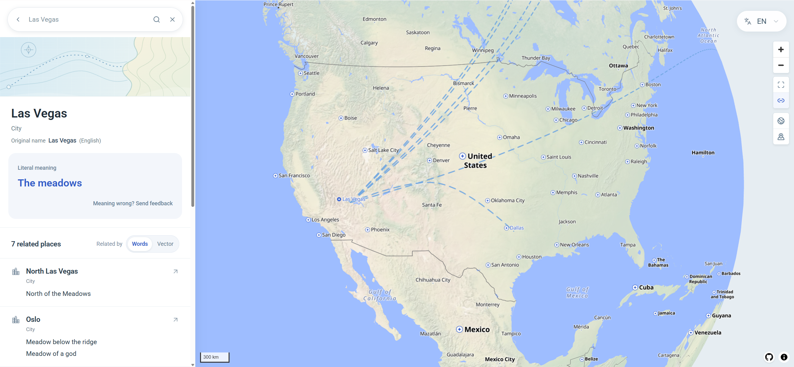

# Place, Literally

I built this to find places whose names mean similar things, even when the names sound nothing alike. Click a country or city to see its literal meaning and explore related places.

[Try the map](https://place-literally.duckdns.org/)



There are two ways to find matches. **Words** looks for shared terms across translations; **Vector** compares precomputed embeddings. Saint John and San Juan, for example, match in both modes.

This is a small side project. I used AI tools to help build it and draft some of the meanings. Coverage is incomplete, and both the meanings and the matches can be wrong. There's a feedback link on each place's card if you spot a mistake.

## Run locally

You'll need Node.js 22.13+, Python 3.11+, and Elasticsearch 9.x. Follow the [backend guide](backend/README.md) to set up the database and Python dependencies. From the project root, with the Python virtual environment active, start the API:

```sh
python -m uvicorn backend.main:app --host 127.0.0.1 --port 8000
```

In another terminal, start the frontend:

```sh
npm ci
npm run dev
```

Open [localhost:5173](http://localhost:5173/). The repository includes a small sample dataset, but not the full Elasticsearch dataset used by the live site.

The [deployment guide](deploy/README.md) covers running the app on a Linux server and restoring an Elasticsearch snapshot.

## Checks

Run `npm test` for frontend tests and `npm run build` to build the app.

## License

Code is licensed under [MIT](LICENSE). See [third-party notices](THIRD_PARTY.md) for map and data licenses.
